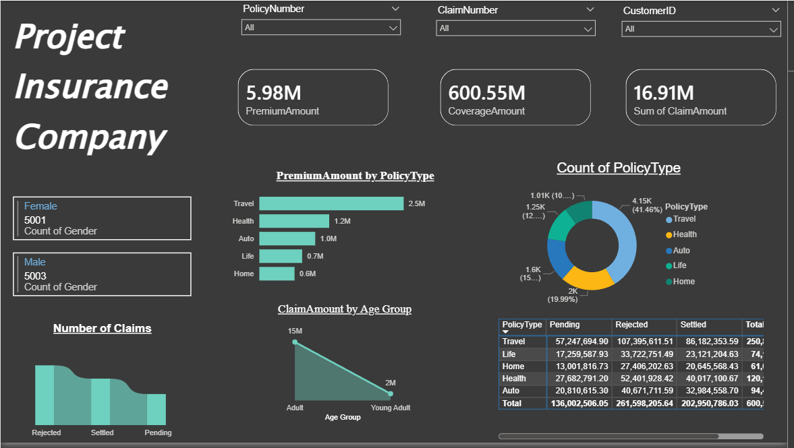

# Power-BI-Project-2-Insurance-Data-Analysis
Power BI Project 2: Insurance Data Analysis using SQL Server, Power BI, drill-through filtering, and role-based access.

## Overview
This project analyzes insurance data in Power BI and focuses on data preparation, SQL-based data loading, interactive dashboard design, drill-through filtering, and role-based access in Power BI.

## Tools Used
- Power BI
- Microsoft SQL Server
- CSV

## Dataset
The dataset used in this project is included in the repository as `InsuranceData.csv`.

## Project Files
- Power BI report: `Power BI Project 2, Insurance Data Analysis.pbix`
- Source dataset: `InsuranceData.csv`

## Data Loading
The data was first loaded into **Microsoft SQL Server**.

Using SQL Server command files, a database named **InsuranceDb** was created. After that, the data from `InsuranceData.csv` was imported into this database.

In Power BI, the data was then loaded by selecting the **SQL Server** connection option and importing the required database and table.

## Data Preparation
The preparation phase included checking data types, null values, and the overall structure of the dataset.

For example, `PolicyNumber` was considered a potential primary key. Additional transformations were also applied, including the creation of an **Age Group** column for analysis.

## Dashboard Design
The report was designed as an interactive insurance dashboard using text boxes, slicers, KPI cards, and multiple visuals.

The dashboard includes:
- Premium amount summary
- Coverage amount summary
- Claim amount summary
- Premium amount by policy type
- Count of policy types
- Number of claims by status
- Claim amount by age group

## Business Questions

### 1. How are premium amounts distributed across policy types?
A bar chart was used to compare **PremiumAmount** across different policy types, making it easier to identify which policy types generate higher premium amounts.

### 2. What is the distribution of policy types?
A donut chart was used to visualize the **count of PolicyType**, showing the share of each policy category in the dataset.

### 3. How do claim amounts vary by age group?
A chart was used to compare **ClaimAmount** across age groups, helping identify which groups account for higher claim amounts.

### 4. What is the number of claims by claim status?
A visual was used to compare the number of claims across statuses such as **Rejected**, **Settled**, and **Pending**.

### 5. How can users filter the dashboard interactively?
Slicers were added for fields such as:
- `PolicyNumber`
- `ClaimNumber`
- `CustomerID`

These slicers allow users to interactively filter the dashboard and focus on specific records.

## Drill-Through Analysis
A second page was created to support **drill-through filtering**.

On this page, a table visual was added, and `PolicyType` was used as the drill-through field. This makes it possible to drill from page 1 to page 2 and pass the selected `PolicyType` as a filter.

## Row-Level Security
Roles were created and tested in Power BI based on the `PolicyType` column.

This was done to simulate restricted access, where some users are allowed to see only specific policy types.

## Acknowledgment
This project is based on **Section 24: Power BI Project 2, Insurance Data Analysis** from the Udemy course **Complete Data Analyst Bootcamp From Basics To Advanced**.

The implementation, report building, and documentation in this repository were completed by me as part of my learning and portfolio work.
